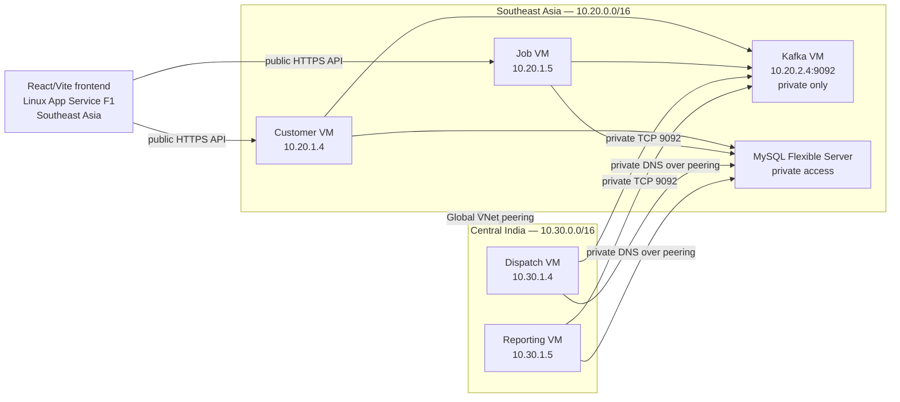

# ASSMS Sprint 1 Azure Infrastructure Status

> Status reconciled with the six repository `dev` branches on 7 September 2026. Runtime statements below are limited to recorded staging evidence; they do not claim that production is deployed.

## Status at a Glance

| Area | Status |
|---|---|
| Terraform remote state | Completed |
| Shared Azure staging platform | Completed |
| Service VM infrastructure | Completed |
| Frontend F1 App Service infrastructure | Completed |
| VM compute cost control | Completed — all five VMs deallocated |
| Application deployment and runtime configuration | Partially completed — Customer, Job, Reporting and Frontend have recorded staging deployment evidence; Dispatch remains pending |
| GitHub Actions CI | Completed |
| GitHub Actions CD | Implemented on `dev` for Customer, Job, Reporting and Frontend; successful run screenshots remain evaluation evidence to capture |
| Prometheus/Grafana monitoring | Deferred to ASSMS-18 |

This record describes the infrastructure provisioned for the After-Sales Service Management System (ASSMS) and the deployment capabilities recorded during Sprint 1. Customer, Job, Reporting and Frontend have staging deployment records. Dispatch deployment, Azure Kafka runtime integration, monitoring and production deployment remain outside the verified Sprint 1 boundary. Secrets and connection strings are intentionally excluded.

## 1. Project and Repository Architecture

ASSMS consists of Customer & Asset, Job, Dispatch, and Reporting backend services, a React/Vite frontend, Kafka, Azure Database for MySQL Flexible Server, Terraform, and GitHub Actions CI.

| Repository | Ownership |
|---|---|
| `assms-platform-infrastructure` | Shared network, MySQL, Kafka VM infrastructure, remote-state outputs, frontend-independent platform resources |
| `assms-customer-asset-service` | Customer & Asset VM and service networking |
| `assms-job-service` | Job VM and service networking |
| `assms-dispatch-service` | Dispatch VM and service networking |
| `assms-reporting-service` | Reporting VM and service networking |
| `assms-frontend` | Linux App Service Plan and Linux Web App |

Each repository has independent Terraform state. Service repositories do not recreate shared platform resources.

## 2. Terraform State Architecture

Terraform state is stored remotely in Azure Storage. Local state, real variable files, backend files, plans, credentials, and private keys are excluded from Git.

| Item | Value |
|---|---|
| State resource group | `rg-assms-tfstate` |
| Storage account | `stassmstfstate45ff260826` |
| Container | `tfstate` |

State keys:

```text
platform/staging.tfstate
customer-asset-service/staging.tfstate
job-service/staging.tfstate
dispatch-service/staging.tfstate
reporting-service/staging.tfstate
frontend/staging.tfstate
```

Saved `.tfplan` files are ignored and removed after a successful apply. Never reuse a saved plan after source or state changes, especially after a partial apply.

## 3. Final Two-Region Staging Architecture



### Primary region: Southeast Asia

- VNet: `vnet-assms-staging` — `10.20.0.0/16`
- Services subnet: `10.20.1.0/24`
- Platform subnet: `10.20.2.0/24`
- Database subnet: `10.20.3.0/24`
- Resources: Customer VM, Job VM, Kafka VM, MySQL Flexible Server, frontend App Service

### Secondary region: Central India

- VNet: `vnet-assms-staging-secondary` — `10.30.0.0/16`
- Services subnet: `10.30.1.0/24`
- Resources: Dispatch VM and Reporting VM

## 4. Why Two Regions Are Used

The Azure for Students Southeast Asia regional vCPU quota was `6`. Kafka, Customer, Job, Dispatch, and Reporting each require 2 vCPU, for a total requirement of 10 vCPU. A self-service quota increase sufficient for the staging design was not granted.

The staging-only solution preserves one VM per backend service without changing subscription type:

- Southeast Asia: Kafka, Customer, and Job — 6 vCPU
- Central India: Dispatch and Reporting — 4 vCPU

The VNets have non-overlapping address spaces and use connected bidirectional Global VNet Peering. Gateway transit and remote gateways are disabled; private traffic can cross the peering.

## 5. Shared Data and Messaging Infrastructure

### MySQL

| Item | Staging configuration |
|---|---|
| Service | Azure Database for MySQL Flexible Server |
| SKU | `Standard_B1ms` |
| Storage | 20 GiB |
| Auto-grow | Disabled for budget control |
| Public network access | Disabled |
| Databases | `customerdb`, `jobdb`, `dispatchdb`, `reportingdb` |

The private DNS zone is linked to both the primary and secondary VNets, allowing Dispatch and Reporting to resolve MySQL privately over peering. Administrator credentials are not documented here.

### Kafka infrastructure

| Item | Staging configuration |
|---|---|
| VM | `vm-assms-kafka-staging` |
| Region | Southeast Asia |
| SKU / architecture | `Standard_B2pls_v2`, Arm64, 2 vCPU / 4 GiB |
| OS | Ubuntu 22.04 Arm64 |
| Private IP | `10.20.2.4` |
| Public IP | None |
| Kafka port | TCP 9092, private only |
| Allowed sources | `10.20.1.0/24`, `10.30.1.0/24` |

Kafka software and Docker have not been deployed to the Azure VM. No SSH, public Kafka, Prometheus, or Grafana rules are enabled. The separate ASSMS-14 local KRaft single-node development environment uses `apache/kafka:4.3.1` and the `job-created`, `job-assigned`, and `job-status-changed` topics; Azure Kafka runtime and business integration are not yet done.

## 6. Service VM Infrastructure

| Service | VM | Region | Private subnet/IP | SKU / architecture | Inbound posture |
|---|---|---|---|---|---|
| Customer & Asset | `vm-assms-customer-staging` | Southeast Asia | `10.20.1.0/24` / `10.20.1.4` | `Standard_B2pls_v2`, Arm64 | No custom inbound rules |
| Job | `vm-assms-job-staging` | Southeast Asia | `10.20.1.0/24` / `10.20.1.5` | `Standard_B2pls_v2`, Arm64 | No custom inbound rules |
| Dispatch | `vm-assms-dispatch-staging` | Central India | `10.30.1.0/24` / `10.30.1.4` | `Standard_B2pls_v2`, Arm64 | No custom inbound rules |
| Reporting | `vm-assms-reporting-staging` | Central India | `10.30.1.0/24` / `10.30.1.5` | `Standard_B2pls_v2`, Arm64 | No custom inbound rules |

All service VMs use Ubuntu 22.04 Arm64, Standard_LRS OS disks, disabled password authentication, and Static Standard public IP resources for controlled administration and deployment. Azure default `DenyAllInBound` remains effective outside reviewed temporary runner `/32` deployment rules: application ports, MySQL and Kafka are not exposed directly.

Dispatch originally partially created its NSG, public IP, NIC, and association in Southeast Asia before quota prevented VM creation. Terraform then replaced only those Dispatch-owned resources during the Central India migration.

Customer, Job and Reporting have recorded staging deployment evidence behind Nginx with their containers bound to loopback. Dispatch has no recorded staging application deployment. This document does not claim that every service is currently running because the VMs may be deallocated for cost control.

## 7. ARM64 Decision

Southeast Asia availability restrictions for preferred x64 B-series sizes led to the selected `Standard_B2pls_v2` Arm64 SKU and Ubuntu 22.04 Arm64 image. Application audits found .NET 8 / `net8.0`, managed MySqlConnector and Swagger dependencies, and no existing x64-only runtime identifiers or native dependencies in the inspected service projects.

Current assessment: **verified for the implemented staging deployment paths, with conditions**. The backend repositories contain multi-stage .NET 8 Dockerfiles, and the Customer, Job and Reporting CD workflows build and inspect `linux/arm64` images. Dispatch still requires runtime deployment evidence. Future native dependencies and Kafka client/runtime additions require renewed ARM64 build and test verification.

## 8. Frontend Azure Infrastructure

| Item | Staging configuration |
|---|---|
| Application | React 19 + Vite 8 client-side SPA |
| Build | `npm run build` → `dist/` |
| App Service Plan | `asp-assms-frontend-staging` |
| Web App | `app-assms-frontend-staging-45ff260826` |
| Region / OS | Southeast Asia / Linux |
| SKU / tier | `F1` / Free |
| HTTPS / TLS / HTTP/2 | Enabled / 1.2 / enabled |
| FTP and publishing basic auth | Disabled |
| Always On | Disabled |

The React production build has recorded staging deployment evidence on the Web App with the Customer API URL supplied at build time. The App Service uses `pm2 serve /home/site/wwwroot --no-daemon --spa` so direct client routes return the SPA shell. F1 is appropriate for this university staging phase but has shared compute, 60 CPU minutes/day, 1 GB RAM, 1 GB storage, no production SLA, and may pause when free-tier quota is exhausted. A reviewed move to B1 is possible later if needed.

## 9. Security Baseline

- Service VMs: password authentication disabled; no public SSH or application rules; no `0.0.0.0/0` SSH.
- Kafka: no public IP; TCP 9092 restricted to private service subnets.
- MySQL: public access disabled; private DNS and network access only.
- Frontend: public HTTPS web endpoint, TLS 1.2, disabled FTP/SCM basic publishing, no app settings or secrets.
- Terraform: remote state; sensitive local files ignored; no credentials committed.

## 10. CI, Kafka Development, and Lessons Learned

ASSMS-16 CI is complete across the six repositories. Backend CI covers Terraform checks plus .NET restore/build/xUnit and coverage where configured. Frontend CI covers Terraform checks, `npm ci`, lint, and build. Platform CI covers Terraform checks. Provider locks were made cross-platform with:

```powershell
terraform providers lock `
  -platform=windows_amd64 `
  -platform=linux_amd64
```

Staging CD workflow definitions are implemented on `dev` for Customer, Job, Reporting and Frontend. They run only after their CI gates pass, deploy the exact tested commit, use GitHub OIDC for Azure authentication, restrict temporary SSH to the runner `/32`, verify health endpoints and remove the temporary rule. Dispatch does not yet have a staging CD workflow. Successful private GitHub Actions run screenshots must be retained as evaluation evidence; the workflow files alone do not prove that every run succeeded.

Key lessons recorded during Sprint 1:

1. Register Azure resource providers before bootstrap where required; Microsoft.Storage initially needed registration.
2. Provider locks must include both Windows and Linux checksums for GitHub-hosted Linux CI.
3. `Standard_B2s` was unavailable in Southeast Asia; `Standard_B2pls_v2` plus Ubuntu Arm64 was selected.
4. A regional quota limit can require an architecture change rather than an expensive SKU or subscription change.
5. Terraform remote state preserves partial-apply progress; never reuse a stale saved plan.
6. Environment variables set in a local PowerShell session are not automatically visible to every agent process.

## 11. Cost Control and Current Power State

The staging VMs are deallocated for cost control:

| VM | Current state |
|---|---|
| Kafka | VM deallocated |
| Customer | VM deallocated |
| Job | VM deallocated |
| Dispatch | VM deallocated |
| Reporting | VM deallocated |

Use the following patterns when work resumes:

```powershell
az vm start --resource-group rg-assms-staging --name <vm-name>
az vm deallocate --resource-group rg-assms-staging --name <vm-name>
```

Deallocation stops VM compute billing but preserves the VM, OS disk, NIC, IP configuration, and Terraform state. Managed disks, Standard public IPs, MySQL, storage, and data transfer can still incur charges. Deallocated VMs also continue to consume regional vCPU quota. MySQL and the F1 frontend were not stopped or modified as part of VM cost control.

## 12. Git and Delivery Status

Branch flow is feature/task branch → pull request → `dev` → stable/final → `main`. Sprint 1 evaluation should use the remote `dev` branch unless the team completes its release merge to `main`.

The Sprint 1 CI and infrastructure work is merged into each repository's remote `dev` branch. At the 7 September 2026 repository check, Dispatch, Platform Infrastructure and Reporting still contained Sprint 1 commits on `dev` that were not in `main`.

### Completed

- [x] GitHub Actions CI
- [x] Remote Terraform state
- [x] Shared staging network, MySQL, four logical databases, and Kafka VM infrastructure
- [x] Customer, Job, Dispatch, and Reporting VM infrastructure
- [x] Secondary Central India network, Global VNet Peering, and MySQL private DNS link
- [x] Frontend F1 App Service infrastructure
- [x] Infrastructure security baseline
- [x] VM cost-control deallocation
- [x] Staging CD definitions for Customer, Job, Reporting and Frontend
- [x] Recorded staging deployment verification for Customer, Job, Reporting and Frontend

### Not yet started

- [ ] Azure Kafka runtime and business-event integration
- [ ] Dispatch staging application deployment and CD
- [ ] End-to-end Kafka publication, consumption and Reporting projection verification
- [ ] Cross-service end-to-end staging test
- [ ] Successful private GitHub Actions run screenshots retained with the evaluation evidence
- [ ] Prometheus/Grafana monitoring (ASSMS-18)

## 13. Future Deployment Sequence

The remaining work after the verified Sprint 1 boundary is:

1. Capture successful GitHub Actions CI/CD run evidence from the private repositories.
2. Deploy Dispatch through a reviewed staging CD path.
3. Deploy and verify the Azure Kafka runtime.
4. Demonstrate Job event publication, Reporting consumption and idempotent read-model updates.
5. Run a complete cross-service staging test and retain its results.
6. Implement and verify Prometheus/Grafana monitoring under ASSMS-18.
