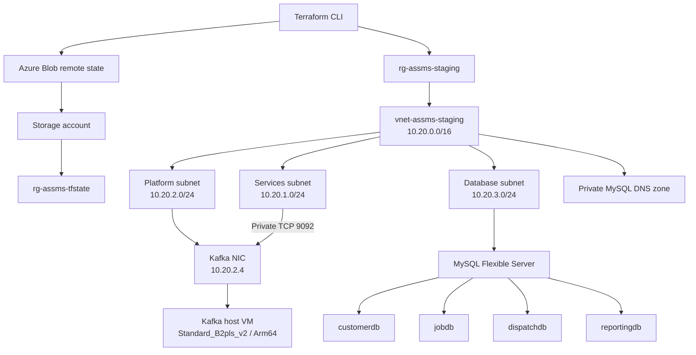

# ASSMS Terraform Staging Platform

## Document purpose

This document records the Terraform work completed for the After-Sales Service Management System (ASSMS) shared Azure staging platform. It describes the implemented architecture, the resources created in Azure, the remote-state arrangement, the commands used to validate and deploy the infrastructure, the security and cost decisions, the Kafka VM recovery, and the work deliberately left for later tasks.

This is an infrastructure runbook and deployment record. It does not claim that the ASSMS applications, Kafka software, Docker, Prometheus, or Grafana have been deployed.

## Current status

Status captured on 26 August 2026:

- The Terraform remote-state bootstrap exists in Azure.
- The shared staging platform has been applied successfully.
- The Azure-backed staging state contains 17 managed resources.
- MySQL and its four logical databases are available through private networking.
- The Kafka host VM exists, but Kafka and Docker are not installed.
- Kafka TCP 9092 is allowed only from the private services subnet.
- No Kafka public IP or public SSH rule exists.
- Monitoring access on ports 3000 and 9090 is postponed to ASSMS-18.
- The four service VMs and frontend App Service are not part of this deployment.

The final Kafka VM apply completed with:

```text
Apply complete! Resources: 1 added, 0 changed, 0 destroyed.
```

The earlier shared-platform apply created the other 16 resources. The final remote state therefore contains 17 resources.

## Repository ownership

The `assms-platform-infrastructure` repository owns only shared ASSMS infrastructure:

- Terraform remote-state infrastructure
- Shared staging resource group
- Shared VNet and subnets
- Shared MySQL Flexible Server
- `customerdb`, `jobdb`, `dispatchdb`, and `reportingdb`
- MySQL private DNS
- Kafka VM infrastructure
- Shared monitoring infrastructure when ASSMS-18 is implemented

The following resources remain owned by their independent repositories:

| Repository | Terraform ownership |
| --- | --- |
| `assms-customer-asset-service` | Customer and Asset Service VM |
| `assms-job-service` | Job Service VM |
| `assms-dispatch-service` | Dispatch Service VM |
| `assms-reporting-service` | Reporting Service VM |
| `assms-frontend` | Azure App Service resources |

Service VM Terraform must not be centralized in the platform repository.

## Architecture



The diagram shows network and infrastructure relationships only. It does not imply that Kafka is running on the VM.

## Terraform layout

```text
terraform/
├── bootstrap/
│   └── tfstate/
├── environments/
│   ├── staging/
│   └── production/
└── modules/
    ├── kafka_vm/
    ├── mysql/
    ├── nic/
    ├── nsg/
    ├── public_ip/
    ├── resource_group/
    ├── subnet/
    └── vnet/
```

The staging and production directories are Terraform root modules. The directories under `terraform/modules/` are reusable only within this repository.

## Terraform and provider baseline

The configuration requires:

- Terraform `>= 1.6.0`
- HashiCorp AzureRM provider `~> 4.0`
- Azure CLI authentication for local operations

The dependency lock file currently resolves AzureRM `4.81.0` where initialized.

No subscription ID, tenant ID, client ID, client secret, storage key, database password, or private key is hard-coded in tracked Terraform.

## Azure authentication and preconditions

Install Terraform and Azure CLI, then authenticate:

```powershell
az login
az account show --output table
```

If the required subscription is not active, select it explicitly:

```powershell
az account set --subscription "<subscription-name-or-id>"
az account show --output table
```

Required resource providers should be registered before planning or applying:

```powershell
az provider register --namespace Microsoft.Storage --wait
az provider register --namespace Microsoft.Network --wait
az provider register --namespace Microsoft.Compute --wait
az provider register --namespace Microsoft.DBforMySQL --wait
```

Confirm registration without exposing credentials:

```powershell
az provider show --namespace Microsoft.Storage --query registrationState -o tsv
az provider show --namespace Microsoft.Network --query registrationState -o tsv
az provider show --namespace Microsoft.Compute --query registrationState -o tsv
az provider show --namespace Microsoft.DBforMySQL --query registrationState -o tsv
```

## Remote-state bootstrap

### Purpose

`terraform/bootstrap/tfstate/` creates only the Azure resources needed to store Terraform state:

- Resource group: `rg-assms-tfstate`
- Storage account: `stassmstfstate45ff260826`
- Private blob container: `tfstate`

The storage account uses:

- Standard performance
- LRS replication
- HTTPS-only traffic
- Minimum TLS 1.2
- Disabled anonymous blob access
- Private container access

### Why the bootstrap uses local state

The bootstrap cannot initially store its state in the backend it is creating. Its own state therefore starts locally. The shared staging configuration uses the Azure backend after the storage resources exist.

The local bootstrap state is ignored by Git, but it is sensitive because an Azure Storage Account resource can place access keys and connection strings in Terraform state. Never commit, print, upload, email, or paste this state file. Do not delete it without first creating a deliberate state migration or recovery plan.

### Bootstrap commands

```powershell
cd terraform/bootstrap/tfstate
Copy-Item terraform.tfvars.example terraform.tfvars
```

Set a globally unique storage account name in the ignored `terraform.tfvars`, then run:

```powershell
terraform init
terraform fmt -check
terraform validate
terraform plan
terraform apply
```

The bootstrap was applied only after Azure Storage provider registration and storage-account name availability were confirmed.

## Staging remote backend

The staging root declares an empty `backend "azurerm" {}` block. Environment-specific backend values are kept in an ignored `backend.hcl` instead of tracked source.

The active backend is:

| Setting | Value |
| --- | --- |
| Resource group | `rg-assms-tfstate` |
| Storage account | `stassmstfstate45ff260826` |
| Container | `tfstate` |
| State key | `platform/staging.tfstate` |

Initialize or reconnect the staging root as follows:

```powershell
cd terraform/environments/staging
Copy-Item backend.hcl.example backend.hcl
```

Replace only the placeholder storage account name in the ignored file, then run:

```powershell
terraform init -reconfigure -backend-config=backend.hcl
terraform state list
```

The backend file, Terraform state, plans, and real variable files are ignored by Git.

## Shared staging resources

### Resource inventory

The Azure-backed staging state contains these 17 managed resources:

| Type | Count | Purpose |
| --- | ---: | --- |
| Resource group | 1 | Contains the shared staging platform |
| Virtual network | 1 | Provides the ASSMS private network |
| Subnets | 3 | Separates services, platform, and database workloads |
| MySQL Flexible Server | 1 | Hosts the four logical ASSMS databases |
| MySQL databases | 4 | One logical database per backend service boundary |
| Private DNS zone | 1 | Resolves the private MySQL hostname |
| Private DNS VNet link | 1 | Links MySQL DNS to the ASSMS VNet |
| Kafka NSG | 1 | Controls traffic to the Kafka host NIC |
| Kafka NSG rule | 1 | Allows private Kafka traffic from services |
| Kafka NIC | 1 | Connects the Kafka VM to the platform subnet |
| NIC-to-NSG association | 1 | Applies Kafka network policy |
| Kafka Linux VM | 1 | Provides the future Kafka/KRaft host |

No Kafka public IP resource exists.

### Shared resource group

| Setting | Value |
| --- | --- |
| Name | `rg-assms-staging` |
| Region | `southeastasia` |
| Environment | `staging` |
| Managed by | Terraform |

### Network

| Network | Address space | Intended use |
| --- | --- | --- |
| `vnet-assms-staging` | `10.20.0.0/16` | Shared ASSMS VNet |
| `snet-assms-services-staging` | `10.20.1.0/24` | Future service-owned backend VMs |
| `snet-assms-platform-staging` | `10.20.2.0/24` | Kafka and future shared platform compute |
| `snet-assms-database-staging` | `10.20.3.0/24` | Delegated MySQL Flexible Server subnet |

The database subnet is delegated to `Microsoft.DBforMySQL/flexibleServers`.

## MySQL Flexible Server

The verified staging MySQL configuration is:

| Setting | Value |
| --- | --- |
| Server | `mysql-assms-staging-45ff260826` |
| State | `Ready` |
| Version | MySQL `8.0.21` |
| SKU | `B_Standard_B1ms` |
| Storage | 20 GiB |
| Storage auto-grow | Disabled |
| Backup retention | 7 days |
| Public network access | Disabled |
| Private DNS zone | `assms-staging.mysql.database.azure.com` |
| Private DNS VNet link | `pdnslink-assms-mysql-staging` |

The 20 GiB allocation is the accepted initial storage size for this configuration. Auto-grow was deliberately disabled to protect the Azure student-credit budget. Capacity must therefore be monitored manually before the server approaches its storage limit.

### Logical database ownership

| Database | Owning service |
| --- | --- |
| `customerdb` | Customer and Asset Service |
| `jobdb` | Job Service |
| `dispatchdb` | Dispatch Service |
| `reportingdb` | Reporting Service |

Terraform creates the logical databases only. It does not create application schemas, tables, users, cross-service foreign keys, or seed data.

## Kafka VM infrastructure

### Verified VM configuration

| Setting | Value |
| --- | --- |
| Name | `vm-assms-kafka-staging` |
| Region | `southeastasia` |
| SKU | `Standard_B2pls_v2` |
| vCPU | 2 |
| Memory | 4 GiB |
| Architecture | Arm64 |
| Image | Canonical Ubuntu Server 22.04 Arm64 |
| Image SKU | `22_04-lts-arm64` |
| OS disk | `Standard_LRS` |
| Password authentication | Disabled |
| NIC | `nic-assms-kafka-staging` |
| Private IP | `10.20.2.4` |
| Public IP | None |
| Boot diagnostics | Enabled |

The NIC receives its address dynamically from Azure, but Azure currently assigned `10.20.2.4` and Terraform exposes that value as an output.

### Network security group

The Kafka NSG contains one custom inbound allow rule:

| Rule | Protocol | Port | Source | Access |
| --- | --- | ---: | --- | --- |
| `AllowKafkaFromServicesSubnet` | TCP | 9092 | `10.20.1.0/24` | Allow |

Security verification confirmed:

- TCP 9092 is private to the services subnet.
- There is no public Kafka rule.
- There is no public SSH rule.
- There is no public IP.
- There are no monitoring rules for TCP 3000 or 9090.
- Password authentication is disabled.

The previously reserved Prometheus and Grafana endpoint strings were removed from the Terraform outputs because they had no consumers and could imply that monitoring was available. Monitoring remains postponed to ASSMS-18.

### Arm64 compatibility

The original `Standard_B2s` VM request failed because that SKU was unavailable to the active Azure for Students subscription in Southeast Asia. Azure CLI checks identified `Standard_B2pls_v2` as an unrestricted, economical replacement with 2 vCPU and 4 GiB RAM.

Because `Standard_B2pls_v2` is Arm64, the image was changed from the x64 Ubuntu image to `Canonical:0001-com-ubuntu-server-jammy:22_04-lts-arm64:latest`. Azure confirmed the SKU capability as Arm64 and the image was available in Southeast Asia.

The intended `apache/kafka:4.3.1` image supports Arm64. Nevertheless, every future Docker image, package, native library, and monitoring agent installed on this host must be checked for Arm64 compatibility.

Terraform currently installs no Docker engine, Kafka broker, KRaft configuration, systemd service, cloud-init payload, or shell bootstrap on the VM.

## Cost and scope decisions

The staging design uses economical development settings:

- Burstable MySQL `B_Standard_B1ms`
- 20 GiB MySQL storage
- Disabled MySQL storage auto-grow
- Burstable Kafka VM `Standard_B2pls_v2`
- Standard LRS Kafka OS disk
- Standard LRS Terraform-state storage
- No Kafka public IP
- No monitoring VMs or services
- No Prometheus/Grafana access rules
- No service VMs or frontend hosting in this apply

Azure prices and student-credit availability can change. Review the Azure Cost Management dashboard before further applies.

## Deployment history and recovery

### Initial shared-platform apply

The first staging apply successfully created 16 shared resources. Only the Kafka Linux VM failed because `Standard_B2s` capacity was unavailable in Southeast Asia.

Terraform retained the 16 successful resources in remote state. The Kafka NIC, NSG, NSG association, and private IP already existed and were preserved.

### Stale plan handling

The plan used for the partial apply became stale immediately after state changed. It was deleted and was not reused.

This is mandatory Terraform practice:

> Never apply a saved plan after a partial apply, state change, configuration change, refresh, or external infrastructure change. Generate and review a fresh plan.

### Kafka recovery plan

After selecting the Arm64 replacement:

1. Staging VM size changed to `Standard_B2pls_v2`.
2. Staging image SKU changed to `22_04-lts-arm64`.
3. Shared NIC, NSG, IP, networking, MySQL, databases, DNS, and backend remained unchanged.
4. Terraform formatting and validation passed.
5. A fresh plan proposed exactly `1 to add, 0 to change, 0 to destroy`.
6. The exact reviewed saved plan was applied.
7. Azure and Terraform state were verified.
8. The saved plan was deleted.

## Standard staging workflow

Run these commands from the repository root unless stated otherwise.

### 1. Confirm branch and working tree

```powershell
git branch --show-current
git status
```

Do not apply from `main` or `dev` while developing unreviewed infrastructure changes.

### 2. Authenticate and select the subscription

```powershell
az login
az account show --output table
```

Do not hard-code Azure credentials in Terraform.

### 3. Prepare ignored local configuration

```powershell
Copy-Item terraform/environments/staging/backend.hcl.example terraform/environments/staging/backend.hcl
Copy-Item terraform/environments/staging/terraform.tfvars.example terraform/environments/staging/terraform.tfvars
```

Replace placeholders locally. Keep `backend.hcl` and `terraform.tfvars` ignored.

For better secret handling, remove the `mysql_admin_password` assignment from the local variable file and provide it through the current process environment:

```powershell
$securePassword = Read-Host "MySQL administrator password" -AsSecureString
$env:TF_VAR_mysql_admin_password = [System.Net.NetworkCredential]::new("", $securePassword).Password
```

Clear the value when Terraform work is complete:

```powershell
Remove-Item Env:\TF_VAR_mysql_admin_password
```

### 4. Initialize the Azure backend

```powershell
terraform -chdir=terraform/environments/staging init -reconfigure -backend-config=backend.hcl
```

### 5. Format and validate

```powershell
terraform fmt -check -recursive terraform
terraform -chdir=terraform/environments/staging validate
```

Use `terraform fmt -recursive terraform` locally when formatting must be corrected. CI performs a check only and does not rewrite files.

### 6. Create a saved plan

Refuse to overwrite an existing plan:

```powershell
$planPath = "terraform/environments/staging/staging.tfplan"
if (Test-Path $planPath) {
    throw "staging.tfplan already exists; review or remove it before generating another plan."
}

terraform -chdir=terraform/environments/staging plan -input=false -out=staging.tfplan
```

Review the add, change, destroy, and replacement counts before approving an apply.

### 7. Apply the reviewed plan

```powershell
terraform -chdir=terraform/environments/staging apply staging.tfplan
```

Do not generate a different plan between approval and apply. Do not use `terraform apply` without the approved plan file for this workflow.

### 8. Verify and remove the plan

After successful Azure and state verification:

```powershell
Remove-Item terraform/environments/staging/staging.tfplan
git status
```

Do not delete a plan before diagnosing a failed apply. Never retry a stale plan after a partial apply.

## Verification commands

### Terraform state

```powershell
terraform -chdir=terraform/environments/staging state list
```

The current staging state should return 17 addresses and include:

```text
module.kafka_vm.azurerm_linux_virtual_machine.this
module.mysql.azurerm_mysql_flexible_server.this
module.vnet.azurerm_virtual_network.this
```

### Kafka VM

```powershell
az vm show `
  --resource-group rg-assms-staging `
  --name vm-assms-kafka-staging `
  --query "{name:name,location:location,state:provisioningState,size:hardwareProfile.vmSize,image:storageProfile.imageReference.sku,passwordDisabled:osProfile.linuxConfiguration.disablePasswordAuthentication}" `
  --output table
```

### Kafka NIC and public IP

```powershell
az network nic show `
  --resource-group rg-assms-staging `
  --name nic-assms-kafka-staging `
  --query "{privateIp:ipConfigurations[0].privateIPAddress,publicIp:ipConfigurations[0].publicIPAddress.id}" `
  --output json

az network public-ip list `
  --resource-group rg-assms-staging `
  --output table
```

### Kafka NSG

```powershell
az network nsg rule list `
  --resource-group rg-assms-staging `
  --nsg-name nsg-assms-kafka-staging `
  --output table
```

Expect only the custom private TCP 9092 rule. Azure-managed default NSG rules are separate from custom rules.

### MySQL

```powershell
az mysql flexible-server show `
  --resource-group rg-assms-staging `
  --name mysql-assms-staging-45ff260826 `
  --query "{state:state,sku:sku.name,storage:storage.storageSizeGb,autoGrow:storage.autoGrow,publicAccess:network.publicNetworkAccess}" `
  --output table

az mysql flexible-server db list `
  --resource-group rg-assms-staging `
  --server-name mysql-assms-staging-45ff260826 `
  --output table
```

### VNet and subnets

```powershell
az network vnet show `
  --resource-group rg-assms-staging `
  --name vnet-assms-staging `
  --output table

az network vnet subnet list `
  --resource-group rg-assms-staging `
  --vnet-name vnet-assms-staging `
  --output table
```

### Private DNS

```powershell
az network private-dns zone show `
  --resource-group rg-assms-staging `
  --name assms-staging.mysql.database.azure.com `
  --output table
```

Direct blob inspection with `az storage blob show --auth-mode login` requires an Azure Storage data-plane role such as Storage Blob Data Reader. A permission error from that command does not by itself mean the Terraform backend is unhealthy. Successful `terraform state list` against the configured AzureRM backend verifies that Terraform can access the remote state.

## Continuous integration

`.github/workflows/terraform-ci.yml` runs on relevant Terraform changes in pull requests and pushes targeting `dev` or `main`.

CI performs:

- Checkout
- Terraform setup
- `terraform fmt -check -recursive terraform`
- Meaningful-root discovery
- `terraform init -backend=false -input=false -lockfile=readonly`
- `terraform validate`

CI does not authenticate to Azure, access remote state, create plans, run `terraform apply`, or deploy applications.

## Security controls

The current implementation enforces or follows these controls:

- No tracked Azure credentials
- No tracked real `terraform.tfvars`
- No tracked backend configuration
- No tracked Terraform state
- No tracked Terraform plans
- No tracked PEM or private key files
- Private MySQL networking
- Private Kafka networking
- No Kafka public IP
- No public SSH rule
- Disabled VM password authentication
- Private Terraform-state container
- HTTPS-only state storage with TLS 1.2 minimum
- Human review of a saved plan before apply

Terraform state must always be treated as sensitive even when Git ignores it.

## Git hygiene

The root `.gitignore` excludes:

```text
.terraform/
*.tfstate
*.tfstate.*
*.tfplan
terraform.tfvars
backend.hcl
.env
.env.*
*.pem
*.key
```

Before committing Terraform changes, run:

```powershell
git status
git diff --check
git diff
git ls-files "*.tfstate" "*.tfplan" "*.pem" "*.key"
```

`terraform.tfvars.example` and `backend.hcl.example` are intentionally tracked because they contain placeholders only.

## Troubleshooting notes

### `az` is not recognized

Install Azure CLI, close and reopen PowerShell, then run:

```powershell
az --version
az login
```

### Azure provider remains `Registering`

Wait for registration rather than repeatedly applying Terraform:

```powershell
az provider register --namespace Microsoft.Storage --wait
az provider show --namespace Microsoft.Storage --query registrationState -o tsv
```

### `Too many command line arguments`

Use Terraform's global `-chdir` option before the command:

```powershell
terraform -chdir=terraform/environments/staging plan -input=false -out=staging.tfplan
```

Do not substitute a secret value into an environment variable name. The MySQL password variable name is always:

```text
TF_VAR_mysql_admin_password
```

### VM SKU unavailable

Do not repeatedly apply the same stale plan. Preserve successful resources, remove the stale plan after diagnosis, inspect economical SKU availability for the active subscription and region, verify architecture compatibility, update Terraform, validate, and create a fresh plan.

### Direct remote blob check returns an authorization error

Terraform backend access and Azure CLI data-plane access can use different authorization paths. Prefer least privilege. Do not retrieve or print Storage Account keys merely to bypass an optional verification command.

## Work intentionally not completed

The following work remains outside this Terraform deployment:

- Docker installation on the Kafka VM
- Kafka 4.3.1 installation and KRaft configuration
- Kafka topic creation
- Prometheus installation
- Grafana installation
- Monitoring NSG rules for ports 9090 and 3000
- Customer and Asset Service VM provisioning
- Job Service VM provisioning
- Dispatch Service VM provisioning
- Reporting Service VM provisioning
- Frontend App Service provisioning
- Application deployment
- Application secrets and connection strings
- Health checks and smoke tests
- Production apply

These tasks require separate review, planning, and explicit apply approval.

## Recommended next steps

1. Review and commit the current ASSMS-17 Terraform source and this documentation.
2. Rotate the Terraform-state Storage Account keys if they have been exposed, then verify backend access.
3. Confirm the 17-resource staging state remains stable with a fresh read-only plan before later infrastructure changes.
4. Implement each service VM from its owning repository.
5. Implement the frontend App Service from `assms-frontend`.
6. Add Docker and Kafka configuration as a separate application/platform task.
7. Implement monitoring and its private NSG rules under ASSMS-18.
8. Add deployment workflows, secrets, health checks, and smoke tests only after application artifacts are ready.

## Completion record

At the end of the verified platform apply:

- Kafka VM creation succeeded.
- Terraform reported `1 added, 0 changed, 0 destroyed` for the final saved plan.
- All 17 expected resources were present in Azure remote state.
- Existing MySQL, databases, VNet, subnets, and private DNS were not changed by the final plan.
- The local `staging.tfplan` was deleted.
- No Terraform state, real variable file, saved plan, credential file, or private key was tracked by Git.
- No Docker, Kafka, monitoring software, backend service VM, or frontend App Service was deployed.
